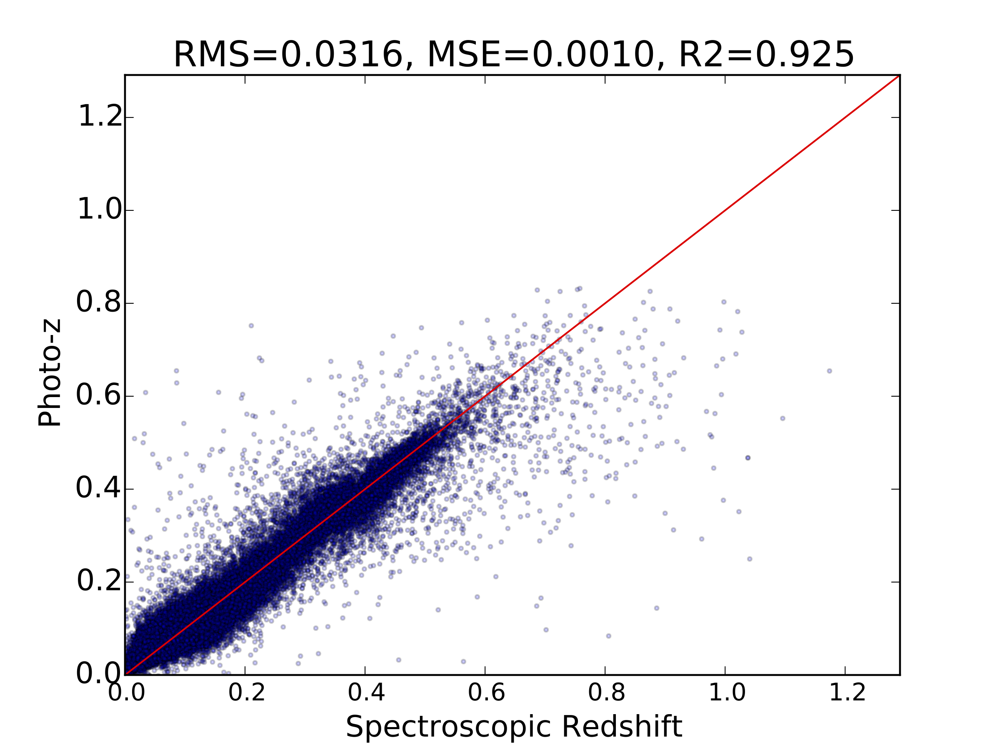
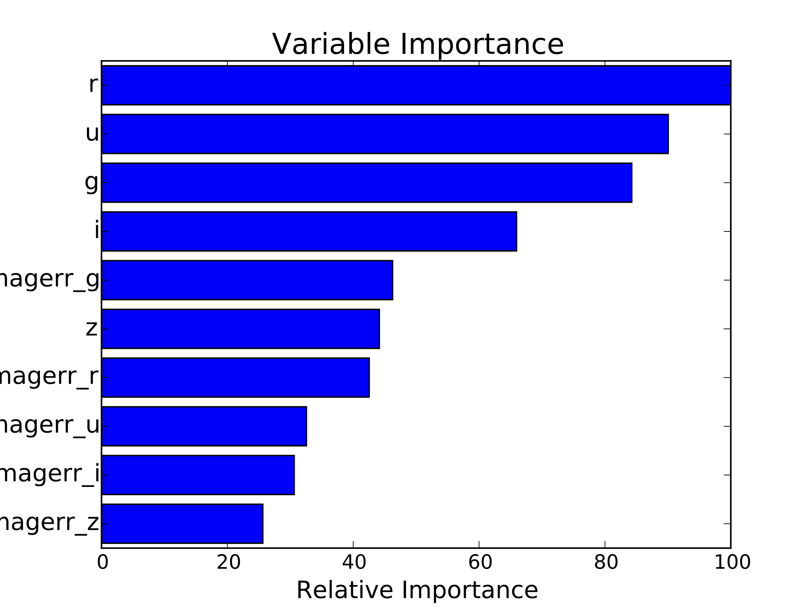

Photometric Redshifts
=====================

This scripts shows simple methods to derive photometric redshifts using machine learning methods.

:requires: pandas
:requires: numpy
:requires: scikit-learn
:requires: matplotlib

tested with:
pandas 0.15.2
Numpy 1.9.2
sklearn 0.15.2
matplotlib 1.4.2

:author: Sami-Matias Niemi
:contact: s.niemi@icloud.com
:version: 0.8

Data can be downloaded from the Kaggle website:
https://inclass.kaggle.com/c/PhotometricRedshiftEstimation/data

The example performance, when using Kaggle competition data, is shown in the Figure below.
The algorithm used was Gradient Boosting Regression, which builds an additive model in a
forward stage-wise fashion. 

The variable importance is shown in the Figure below.

